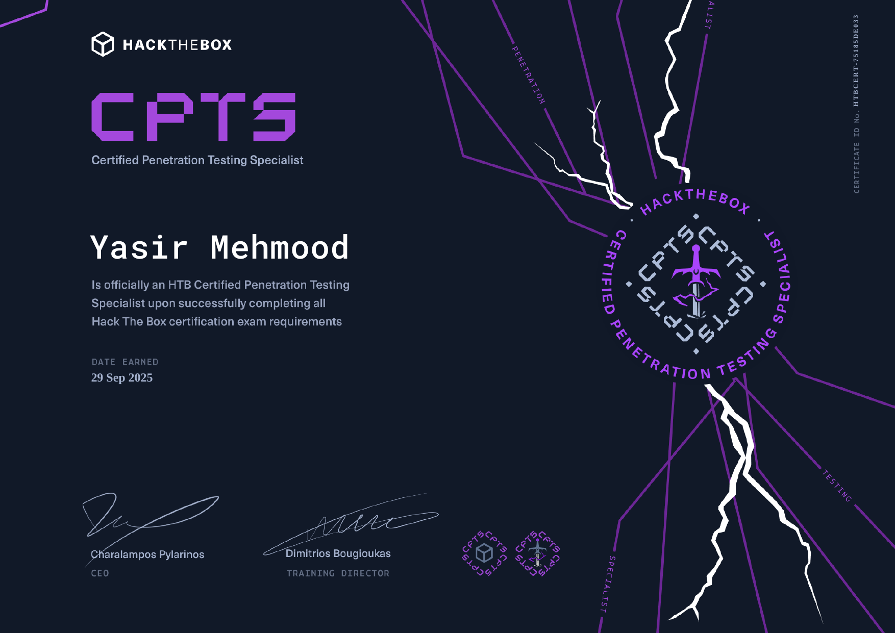

# HTB Certified Penetration Testing Specialist (CPTS)

  

## 📜 Certification Overview

The **HTB Certified Penetration Testing Specialist (CPTS)** is an advanced, hands-on certification offered by **Hack The Box**. It validates the ability to perform comprehensive penetration tests in realistic, multi-layered environments. The certification requires passing a **10-day (240-hour) practical exam** that simulates a real-world corporate network, covering Linux, Windows, web applications, and Active Directory.

The exam emphasizes the entire penetration testing lifecycle—from reconnaissance and exploitation to post-exploitation and reporting. Candidates must demonstrate not only technical skills but also the ability to document findings professionally.

## 🧠 Skills and Knowledge Acquired

Through this certification, I have gained in-depth experience in the following areas:

### Reconnaissance & Information Gathering

- **OSINT techniques** – harvesting data from public sources.
- **Passive and active scanning** – using tools like Nmap, Masscan, and Wireshark.
- **Enumeration** – extracting detailed information from services (SMB, FTP, SMTP, DNS, etc.).

### Vulnerability Assessment & Exploitation

- **Web application testing** – identifying and exploiting SQLi, XSS, SSRF, LFI/RFI, IDOR, and command injection.
- **Network exploitation** – attacking misconfigured services, weak credentials, and unpatched software.
- **Exploit development** – modifying existing exploits and writing custom scripts to bypass modern defenses (Windows Defender, host firewalls).

### Post-Exploitation & Lateral Movement

- **Privilege escalation** – on both Linux (SUID, kernel exploits, sudo misconfigurations) and Windows (token impersonation, unquoted service paths, vulnerable drivers).
- **Pivoting & tunneling** – using tools like Chisel, SSH tunneling, and Metasploit to move through segmented networks.
- **Lateral movement** – abusing Windows authentication (pass-the-hash, pass-the-ticket), PSExec, WMI, and scheduled tasks.
- **Persistence mechanisms** – installing backdoors, creating services, and maintaining access.

### Active Directory Attacks

- Enumeration of AD objects using PowerView, BloodHound, and LDAP queries.
- Exploitation of Kerberos (Kerberoasting, AS-REP roasting), ACL abuse, and delegation attacks.
- Domain privilege escalation and compromise.

### Reporting & Methodology

- Writing professional penetration testing reports with executive summaries, technical findings, and remediation advice.
- Applying industry-standard methodologies (PTES, OWASP) to structure assessments.

### Tool Proficiency

- **Metasploit Framework** – advanced usage, auxiliary modules, and post-exploitation.
- **Burp Suite** – manual and automated web testing, extensions.
- **C2 frameworks** – Empire, Cobalt Strike basics.
- **Scripting** – Python, Bash, and PowerShell for automation and custom exploits.

## 📄 Certificate Verification

You can verify the official certificate here: [**Verify HTB-CPTS Certificate**](https://www.credly.com/badges/6b445d9c-3236-4d1e-bce4-9800be93428b)

---
