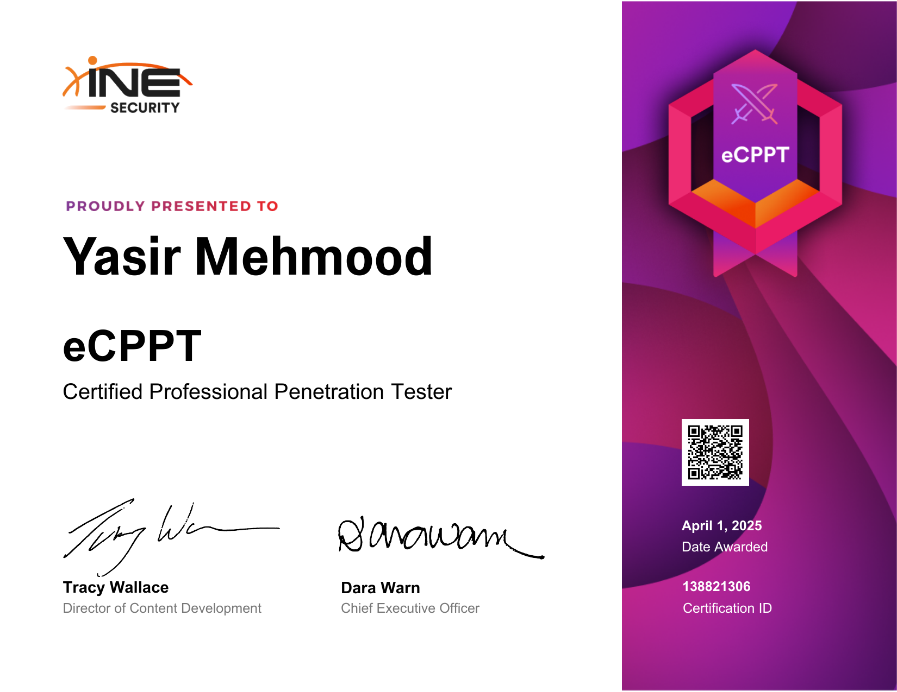

# INE Certified Professional Penetration Tester (eCPPT)

  

## 📜 Certification Overview

The **eCPPT (Certified Professional Penetration Tester)** is a highly practical certification from **INE Security**. The exam is a **48-hour** real-world penetration test against a multi-layered corporate network. Candidates must compromise various systems, pivot through different network segments, and deliver a comprehensive professional report. It is one of the most respected hands-on certifications in the industry.

## 🧠 Skills and Knowledge Acquired

### Planning & Scoping

- Defining engagement rules, legal boundaries, and objectives.
- Selecting appropriate tools and methodologies for the target environment.

### Reconnaissance & Scanning

- Deep-dive network scanning with Nmap (scripts, version detection, OS fingerprinting).
- Vulnerability scanning using Nessus and manual verification.
- Enumerating services (SMB, HTTP, SMTP, SNMP) for misconfigurations.

### Exploitation

- **Buffer overflow exploitation** – on both Windows and Linux (SEH, Egghunter, custom shellcode).
- **Web application attacks** – SQLi, XSS, file inclusion, and insecure direct object references.
- **Network service exploitation** – attacking weak protocols, default credentials, and unpatched software.

### Pivoting & Lateral Movement

- Setting up proxies (Proxychains, SSH dynamic forwarding) to access internal networks.
- Routing traffic through compromised hosts using Metasploit and port forwarding.
- Leveraging stolen credentials and hashes to move laterally.

### Post-Exploitation

- Dumping passwords with Mimikatz, extracting hashes from SAM and LSASS.
- Capturing keystrokes, screenshots, and sensitive files.
- Installing persistent backdoors (services, scheduled tasks, registry run keys).

### Reporting

- Producing a complete, executive-ready penetration test report.
- Documenting the attack chain with screenshots, commands, and impact analysis.
- Providing clear, actionable remediation steps.

## 📄 Certificate Verification

You can verify the official certificate here: [**Verify eCPPT Certificate**](https://certs.ine.com/473b3c53-aa0c-4e3c-8e4f-564940663ccc#acc.dKwiy3J4)

---
