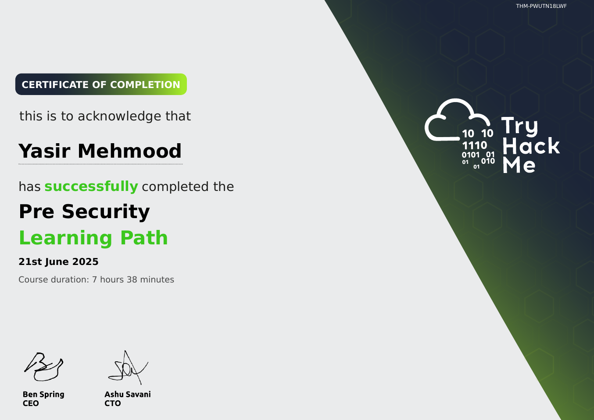

# TryHackMe: Pre Security

  

## 📜 Course Overview

The **Pre Security** learning path is a beginner-friendly introduction to core cybersecurity concepts, designed to build foundational knowledge before diving into offensive security. It covers essential topics like networking, web fundamentals, and security basics. This path includes foundational rooms such as *"Intro to LAN"*, *"HTTP in Detail"*, and *"Linux Fundamentals"* that provide hands-on experience with basic system navigation and network concepts.

## 🧠 Skills and Knowledge Acquired

- Understood basic networking concepts including the OSI model, TCP/IP, and common protocols.
- Learned how web applications work, including HTTP/HTTPS requests, responses, and methods.
- Gained familiarity with Windows and Linux file systems, directories, and basic commands.
- Explored introductory security concepts such as firewalls, VPNs, and basic threat landscapes.

## 📄 Certificate

You can view the official certificate here: [**Verify Certificate**](https://tryhackme-certificates.s3-eu-west-1.amazonaws.com/THM-PWUTN18LWF.pdf)

---
