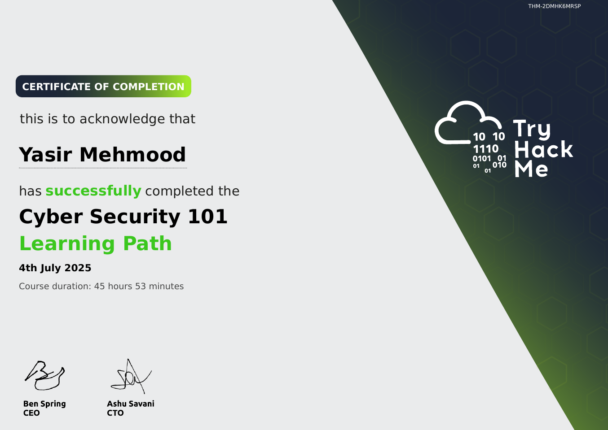

# TryHackMe: Cyber Security 101

  

## 📜 Course Overview

The **Cyber Security 101** learning path provides a broad introduction to the field of cybersecurity, covering both theoretical concepts and practical applications. It serves as a stepping stone for anyone starting their journey in security. This path features rooms like *"Intro to Cyber Security"*, *"Principles of Security"*, and introductory CTF challenges that simulate real-world scenarios.

## 🧠 Skills and Knowledge Acquired

- Learned fundamental security principles like the CIA triad, authentication, and access control.
- Explored different career paths and specializations within the cybersecurity industry.
- Gained hands-on experience with basic security tools and introductory capture-the-flag challenges.
- Understood common attack types and basic defense mechanisms used in modern environments.

## 📄 Certificate

You can view the official certificate here: [**Verify Certificate**](https://tryhackme-certificates.s3-eu-west-1.amazonaws.com/THM-2DMHK6MRSP.pdf)

---
