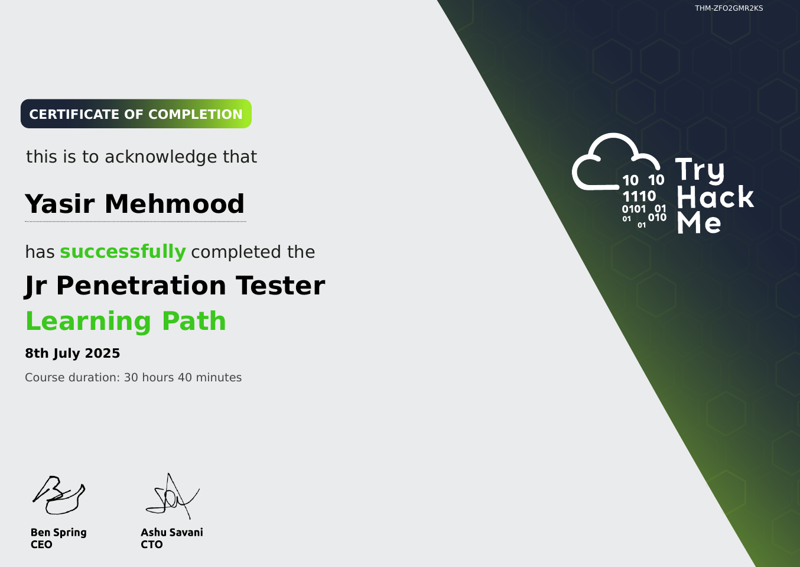

# TryHackMe: Jr Penetration Tester

  

## 📜 Course Overview

The **Jr Penetration Tester** learning path is designed to teach the core skills required for entry-level penetration testing roles through practical, hands-on rooms. It covers the entire assessment process from reconnaissance to reporting. This path contains key rooms including the famous *"OhSINT"* for OSINT, *"VulnNet: Roasted"* for Active Directory basics, and *"Buffer Overflow Prep"* for learning exploit development.

## 🧠 Skills and Knowledge Acquired

- Mastered reconnaissance techniques including passive OSINT and active scanning with Nmap.
- Learned vulnerability assessment and exploitation using tools like Metasploit and manual techniques.
- Understood web application attacks such as SQL injection, XSS, and directory traversal.
- Gained experience in post-exploitation basics including privilege escalation on Linux and Windows.

## 📄 Certificate

You can view the official certificate here: [**Verify Certificate**](https://tryhackme-certificates.s3-eu-west-1.amazonaws.com/THM-ZFO2GMR2KS.pdf)

---
