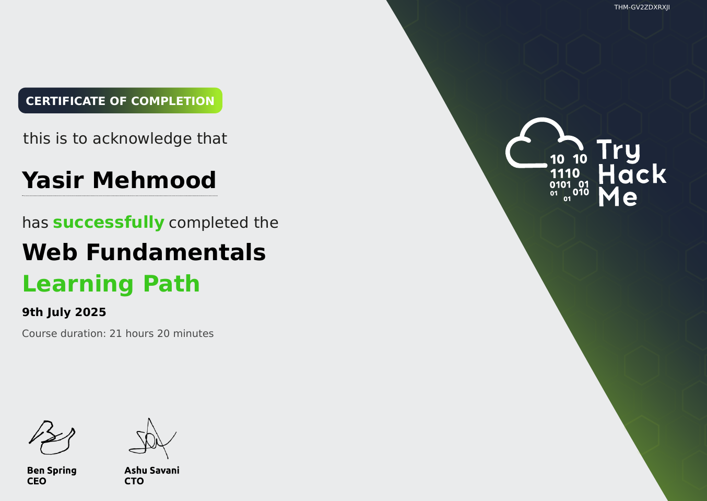

# TryHackMe: Web Fundamentals

  

## 📜 Course Overview

The **Web Fundamentals** learning path focuses on understanding how web technologies work and the security implications behind them. It is essential for anyone looking to specialize in web application security. This path comprises essential rooms such as *"HTTP in Detail"*, *"Burp Suite: The Basics"*, and *"Intro to SSRF"* that build a strong foundation in web technologies.

## 🧠 Skills and Knowledge Acquired

- Learned how the HTTP protocol works including requests, responses, headers, and status codes.
- Understood client-side technologies like HTML, CSS, and JavaScript and their security considerations.
- Explored how servers process requests and handle sessions, cookies, and authentication.
- Gained hands-on experience with Burp Suite for intercepting and modifying web traffic.

## 📄 Certificate

You can view the official certificate here: [**Verify Certificate**](https://tryhackme-certificates.s3-eu-west-1.amazonaws.com/THM-GV2ZDXRXJI.pdf)

---
