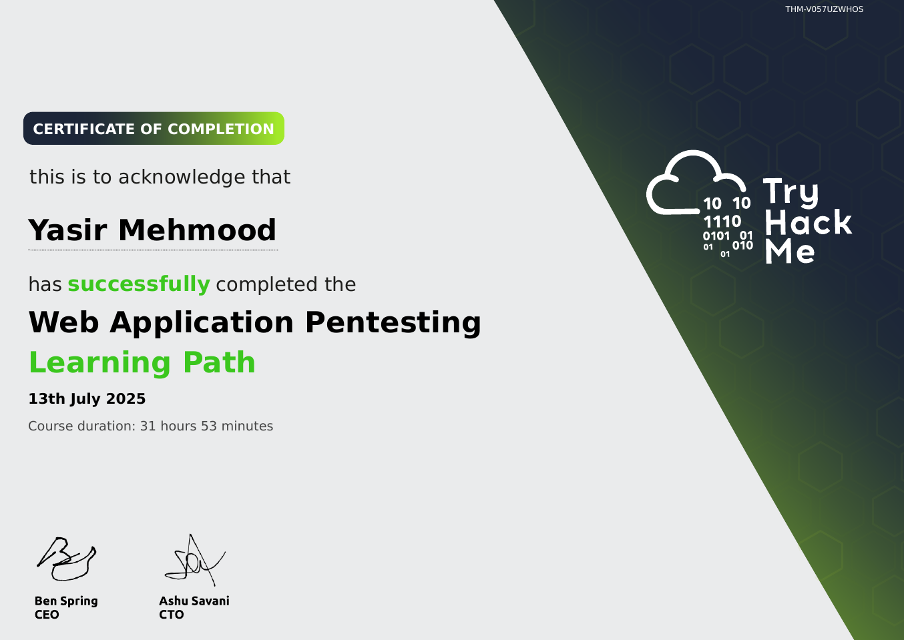

# TryHackMe: Web Application Pentesting

  

## 📜 Course Overview

The **Web Application Pentesting** learning path dives deep into identifying and exploiting vulnerabilities in web applications. It follows OWASP methodologies and provides practical experience with real-world attack scenarios. This path features notable rooms including *"OWASP Top 10"*, *"OWASP Juice Shop"* (a deliberately vulnerable web application), and *"Authentication Bypass"* with hands-on capture-the-flag challenges.

## 🧠 Skills and Knowledge Acquired

- Identified and exploited OWASP Top 10 vulnerabilities including SQLi, XSS, and CSRF.
- Learned advanced Burp Suite usage for automated scanning, repeater, intruder, and sequencer.
- Understood authentication bypass techniques, session hijacking, and privilege escalation in web apps.
- Exploited file inclusion vulnerabilities (LFI/RFI) and server-side request forgery (SSRF).

## 📄 Certificate

You can view the official certificate here: [**Verify Certificate**](https://tryhackme-certificates.s3-eu-west-1.amazonaws.com/THM-V057UZWHOS.pdf)

---
