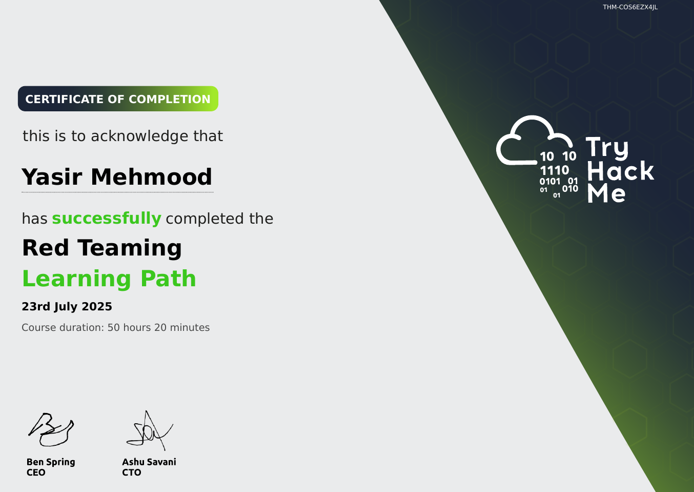

# TryHackMe: Red Teaming

  

## 📜 Course Overview

The **Red Teaming** learning path simulates real-world adversary operations, focusing on evading defenses and achieving specific objectives without detection. It goes beyond traditional penetration testing. This path consists of specialized rooms including *"Red Team Recon"*, *"Atomic Red Team"* for detection testing, and *"C2: Command & Control"* frameworks like Covenant and Metasploit.

## 🧠 Skills and Knowledge Acquired

- Understood the red teaming methodology including adversary emulation and threat modeling.
- Learned evasion techniques to bypass AV/EDR solutions using custom tooling and obfuscation.
- Mastered advanced Active Directory attacks including delegation abuse and trust relationships.
- Gained experience with C2 infrastructures, payload generation, and operational security (OPSEC).

## 📄 Certificate

You can view the official certificate here: [**Verify Certificate**](https://tryhackme-certificates.s3-eu-west-1.amazonaws.com/THM-COS6EZX4JL.pdf)

---
