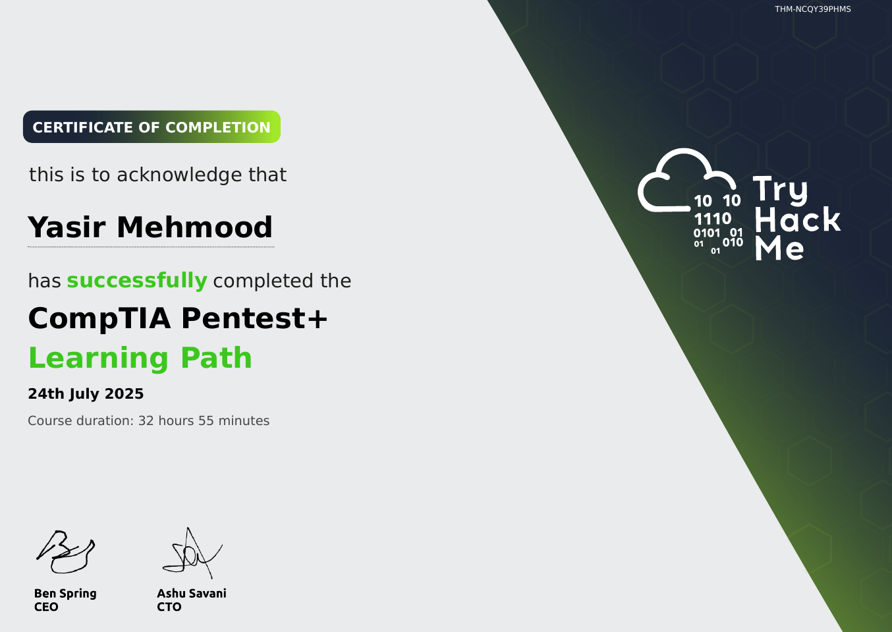

# TryHackMe: CompTIA Pentest+

  

## 📜 Course Overview

The **CompTIA Pentest+** learning path covers the official exam objectives for the CompTIA Pentest+ certification, focusing on penetration testing skills and knowledge required for professional assessments. This path includes rooms aligned with the exam domains, featuring *"Pentesting Fundamentals"*, *"Vulnerability Research"*, and *"Report Writing"* with practical exercises.

## 🧠 Skills and Knowledge Acquired

- Understood planning and scoping phases of penetration testing engagements including legal and compliance considerations.
- Learned information gathering and vulnerability identification techniques using various scanning tools.
- Gained knowledge of attacks and exploits across networks, web applications, and cloud environments.
- Mastered post-exploitation activities, reporting, and communication of findings to stakeholders.

## 📄 Certificate

You can view the official certificate here: [**Verify Certificate**](https://tryhackme-certificates.s3-eu-west-1.amazonaws.com/THM-NCQY39PHMS.pdf)

---
