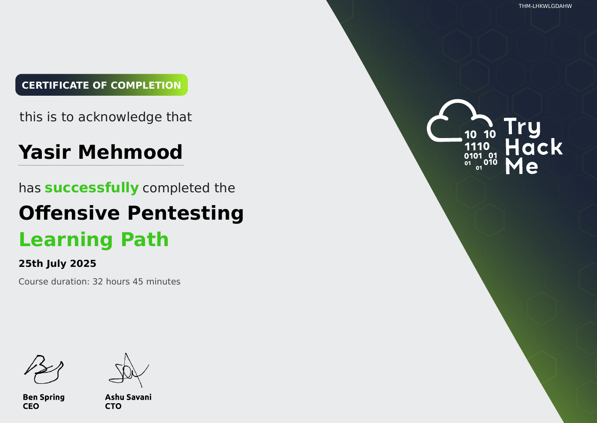

# TryHackMe: Offensive Pentesting

  

## 📜 Course Overview

The **Offensive Pentesting** learning path focuses on advanced penetration testing techniques and methodologies used in professional engagements. It covers everything from initial access to domain compromise. This path contains advanced rooms such as *"Buffer Overflow Prep"*, *"Active Directory Basics"*, *"Hololive"* (a challenging AD environment), and *"Wreath"* (a multi-network pivoting challenge).

## 🧠 Skills and Knowledge Acquired

- Mastered buffer overflow exploitation on Windows systems, including SEH and Egghunter techniques.
- Learned Active Directory enumeration and exploitation, including Kerberoasting and pass-the-hash.
- Performed advanced privilege escalation and persistence mechanisms on both Linux and Windows.
- Utilized C2 frameworks and tunneling techniques for post-exploitation and pivoting.

## 📄 Certificate

You can view the official certificate here: [**Verify Certificate**](https://tryhackme-certificates.s3-eu-west-1.amazonaws.com/THM-LHKWLGDAHW.pdf)

---
