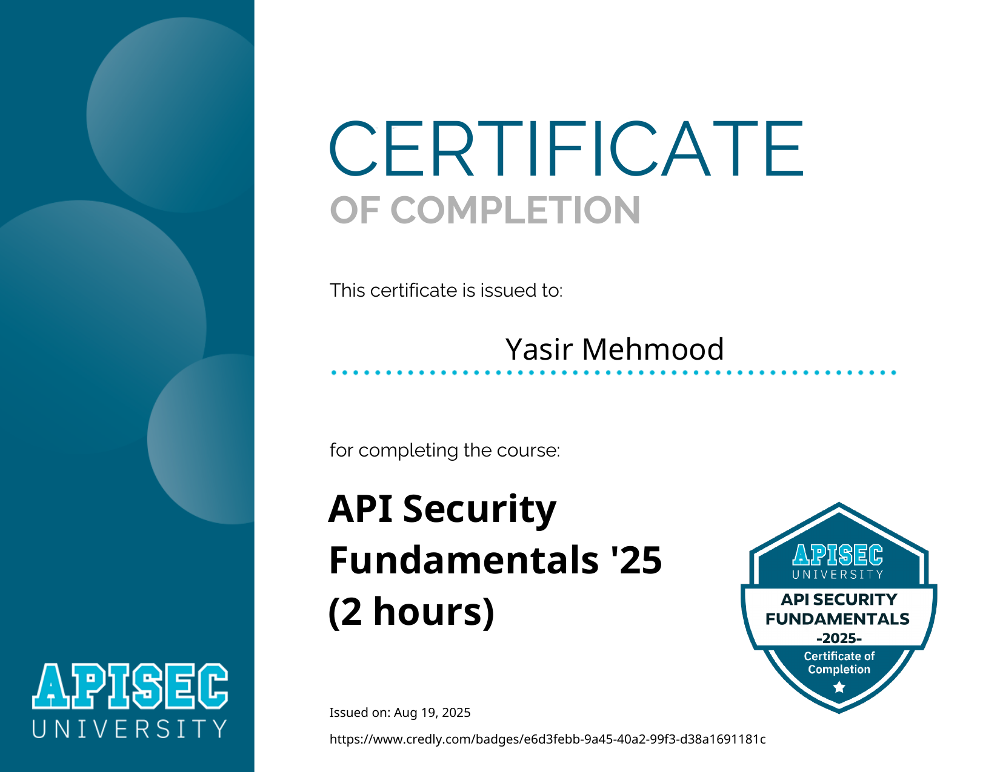

# APISec University: API Security Fundamentals '25

  

## 📜 Course Overview

The **API Security Fundamentals** course provides a concise introduction to the unique security challenges posed by APIs. It covers the OWASP API Security Top 10 and basic testing methodologies. This **2-hour course** includes modules on API architecture, common vulnerabilities, and hands-on exercises with simple API testing scenarios using tools like Postman.

## 🧠 Skills and Knowledge Acquired

- Understood what APIs are, how they work (REST, GraphQL), and their role in modern applications.
- Learned the OWASP API Security Top 10 vulnerabilities and their potential impact.
- Gained knowledge of basic API authentication mechanisms including JWT, OAuth, and API keys.
- Explored fundamental API testing approaches and common security misconfigurations.

## 📄 Certificate

You can view the official certificate here: [**Verify Certificate**](https://www.credly.com/earner/earned/badge/e6d3febb-9a45-40a2-99f3-d38a1691181c)

---
