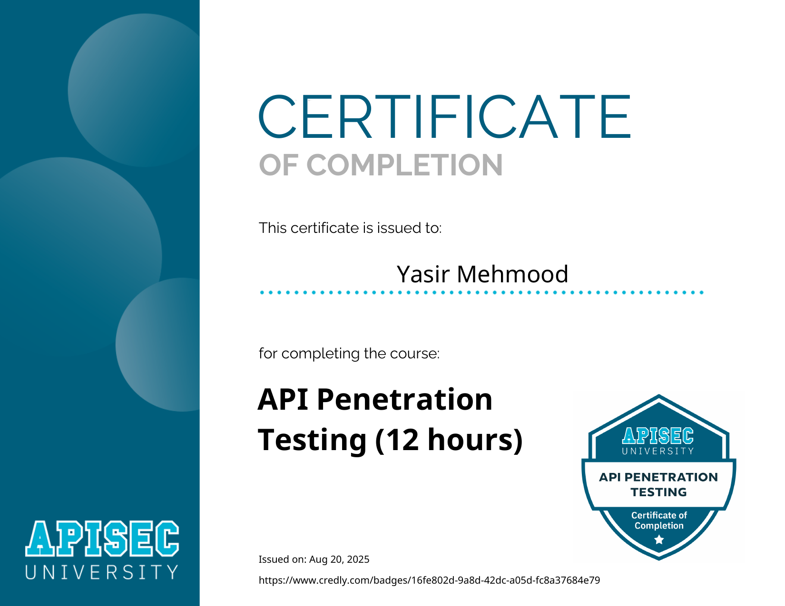

# APISec University: API Penetration Testing

  

## 📜 Course Overview

The **API Penetration Testing** course is a hands-on deep dive into testing APIs for security vulnerabilities. It covers both automated and manual techniques for discovering and exploiting API flaws. This **12-hour comprehensive course** includes practical labs on attacking real-world APIs, working with tools like Burp Suite, Kiterunner, and custom Python scripts for fuzzing and exploitation.

## 🧠 Skills and Knowledge Acquired

- Mastered API reconnaissance including endpoint discovery, parameter fuzzing, and schema enumeration.
- Learned to test for broken object level authorization (BOLA) and excessive data exposure.
- Exploited authentication flaws, rate limiting issues, and mass assignment vulnerabilities.
- Gained hands-on experience with tools like Postman, Burp Suite, and custom scripts for API testing.

## 📄 Certificate

You can view the official certificate here: [**Verify Certificate**](https://www.credly.com/earner/earned/badge/16fe802d-9a8d-42dc-a05d-fc8a37684e79)

---
