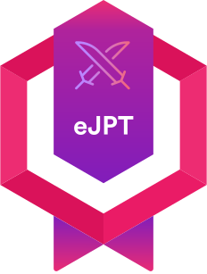

<h1 align="center"> 👋 Hi, its <b>Yasir Mehmood A.K.A Leopard </b> </h1> 

	
	
	
	
	
	
	
	
	

<h2></h2>

	
	
	
	

<h2></h2>

	
	

<h2></h2>
<ul>
	<li><b>🕸️ Website: </b> <a href="https://le0pard.vercel.app/" target="_blank" > le0pard.vercel.com </a></li>
	<li><b>📈 Linkedin: </b> <a href="https://www.linkedin.com/in/yasir-mehmood-l65/" target="_blank"> Yasir Mehmood </a></li>
	<li><b>👨🏼‍💻 HackTheBox: </b> <a href="https://app.hackthebox.eu/profile/1998521"> TheLeopard65 </a></li>
	<li><b>👨🏼‍💻 TryHackMe: </b> <a href="https://tryhackme.com/p/Leopard65"> Leopard65 </a></li>
	<li><b>📧 Email: </b> <a href="mailto:Leopardplaysctf@gmail.com" target="_blank"> Leopardplaysctf@gmail.com </a></li>
	<li><b>🚀 Discord: </b> <a href="https://discord.com/users/735761355545772054" target="_blank"> theleopard65 </a></li>
</ul>
<h2 align="center"> 💻 TECH & SKILLS: <h2>

	

<h2 align="center"> 📊 QUICK STATS </h2>

	
	

